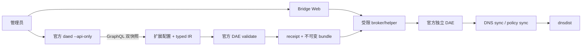

# daed-independent-bridge

官方 daed 管理配置，独立 bridge 完成配置转换和受控应用，官方 DAE 独占数据面。
官方二进制未经修改，版本及下载包、成员哈希固定在 [upstream.lock.json](upstream.lock.json)。



官方 daed 页面负责配置；bridge 页面负责独立 DAE 的应用和生命周期。
不使用 daed 数据库的 running 字段冒充独立 DAE 状态。

## 发布状态与支持平台

提供标准安装入口；版本见 `VERSION`，可用的已发布资产以 GitHub Releases 为准。
支持 Debian 13 amd64、systemd、Python 3.13；其他 Debian 版本不沿用不匹配的依赖锁。
需要支持官方 DAE 的 BPF 内核。首次安装不接管其他 DNS 服务或已有数据库。
通用 DNS 生成器和 console 控制代码已从本地既有实现提取，去除了站点配置和旧数据库读取。
详见 [发布配置](deployment/release/README.md) 和 [来源说明](deployment/release/PROVENANCE.md)。

## 安装入口

在可信的代码目录中执行（先检查代码/版本；不支持 curl 管道直接运行）：

```sh
git clone https://github.com/ffeng1992/daed-independent-bridge-public.git
cd daed-independent-bridge-public
sudo sh install.sh
```

首次运行交互询问LAN地址/网段/接口、DNS上游、健康查询域名和Web监听地址。
也可一次性传入非秘密设置文件：

```sh
sudo sh install.sh --settings /root/bridge-settings.json
```

格式见 [settings.example.json](deployment/release/settings.example.json)，文档地址只作占位符。
安装器安装Debian运行依赖，逐成员校验锁定官方发布包及带哈希的Python依赖，
安装固定路径程序、生成 Bridge 专用登录令牌和 TLS 配置，并启动管理页面。
**不会创建、重置或修改官方 daed 账号**，新数据库保持 `numberUsers=0`。
不会生成或保存 initial daed admin password。

首次安装后打开 `http://<管理IP>:2023/`，按官方页面确认 GraphQL 地址。
用户数为 0 时，第一次提交账号表单由官方 `createUser` 创建管理员；随后登录，
官方页面初始化默认配置。已有用户时只登录，不重建账号。
后续修改密码使用官方页面 **账户设置 → 修改密码**（官方 `updatePassword`）。
不要在错误详情或截图中分享密码；原版前端可能在错误详情显示 GraphQL variables，
记录为 `UPSTREAM_SECURITY_ISSUE`，本项目不修改上游资源来掩盖该行为。

**Bridge Web 账号独立**：使用 `/etc/daed-independent-bridge/bridge-login.token`
中的专用令牌登录（root:independent-bridge 0640），不接受 daed 用户名/密码或 daed token 登录。
完成官方配置后，先在 daed 页面将 LAN 接口、DNS 监听 `tcp+udp://127.0.0.1:5353`、
DNS 上游 `tcp+udp://127.0.0.1:5534` 和路由设为自己的预期值，然后执行：

```sh
sudo sh install.sh --connect-daed
```

此命令交互验证已存在的官方账号，密码不保存；仅保存供采集/attestor 使用的 API token。
它不修改官方账号或配置，经双快照、扩展、receipt、validate 和 helper 应用用户选中的配置。
Bridge 登录令牌不会发送给 daed。修改官方密码后可再次执行此命令更新采集授权。
配置尚未完成时安装报告 `setupRequired=true, dataplaneReady=false`，不会启动 DAE；
独立 `health-check.sh` 此时返回非零，不把未配置状态当成数据面 PASS。
Web默认由提供的IPv4地址在8443端口提供TLS服务；初始自签证书需由管理员信任或后续替换。
官方 daed API backend 只在 `127.0.0.1:2024` 监听；2024 不向 LAN 开放，也不提供 dashboard。
官方 **Daed Web v1.28.0** 独立提供于 `http://<webAddress>:2023/`，负责节点、订阅、组、routing 和 DNS 配置。
**Bridge Web** 保留在 `https://<webAddress>:8443/`，负责真实独立 DAE 状态、preview、validate/apply 和生命周期。
Daed Web 使用官方默认 HTTP 2023，账号由官方 backend 管理；Bridge Web 使用 TLS 和独立认证。
Daed Web 根入口直接提供官方 index.html；官方默认同源 `/graphql` 由 nginx 转发到 loopback backend。
不取消 `--api-only`；官方页面 Run 按钮不是独立 DAE 的启动入口。
详见 [官方前端来源和连接方式](deployment/release/DAED_WEB.md)。
代理节点和路由由用户后续配置，安装器不虚构订阅或代理能力。

重复执行：相同 payload 未指定 `--connect-daed` 时只做当前阶段检查，不重启；版本不同明确拒绝，要求使用升级入口。
不覆盖用户数据库、Web配置、TLS密钥、attestor token或扩展配置。

## 升级

```sh
# 检出并核对待升级的可信版本后：
sudo sh upgrade.sh
```

先验证旧安装文件与新payload，再停受管理服务，升级程序/unit并重新启动。
保留数据库、配置、凭据、bundle及geodata；健康检查失败返回非零。
不包含新的自动回滚系统，失败后须按错误处理，不得视为升级成功。

## 卸载与数据保留

```sh
sudo sh uninstall.sh
# 明确删除项目持久数据：
sudo sh uninstall.sh --purge --confirm-purge DELETE-INDEPENDENT-BRIDGE
```

默认停止并禁用项目units、删除安装清单内程序和unit，保留以下状态数据。
`--purge`缺少上述精确确认值会在停止服务前拒绝。
purge只删除固定项目数据目录；dnsdist配置、共享policy DNS和ingress-sync资产不属于本包，不删除。
不会扫描或删除其他仓库、历史生产目录或其他项目数据。

## 健康检查

```sh
sudo sh health-check.sh
```

只读检查官方daed的api-only身份与哈希、真实bridge/DAE身份、activeBundle/config哈希、
LAN53及DAE5353的UDP/TCP实际DNS查询、DAE=UP/DIRECT=DOWN/consistent=true、
Bridge Web匿名拒绝，以及短期认证会话读取的身份与broker一致；
另核对官方 Daed Web 的 HTTP、静态文件哈希、经前端同源代理的真实 GraphQL 读取、2024仅loopback监听及唯一独立DAE。会话检查完成后退出登录。
不记录凭据，不硬编码节点/分组数量，也不把单一商业网站作为健康条件。

`/etc/daed-independent-bridge/health.json`由管理员配置，root-owned，0600或0640：

```json
{"lanAddress":"192.0.2.1","dnsName":"health.example.invalid"}
```

以上仅为占位示例，须填写实际LAN监听地址及能返回A记录的健康查询域名。
任何必需检查失败均返回非零；不回显令牌、配置内容或子进程敏感输出。

## 路径和服务

| 路径 | 内容 | 默认卸载 |
|---|---|---|
| `/opt/bridge-daed-web` | 官方前端原件 | 删除文件 |
| `/opt/bridge` | bridge程序及锁定依赖 | 删除受管理文件 |
| `/opt/bridge-official`、`/opt/bridge-service` | 固定官方程序 | 删除程序，保留assets |
| `/etc/daed-independent-bridge` | Web/TLS、token、健康检查配置 | 保留配置 |
| `/var/lib/bridge-daed` | 官方daed数据库 | 保留 |
| `/var/lib/bridge-m4-client` | 扩展配置、候选及客户端状态 | 保留 |
| `/var/lib/daed-independent-bridge` | 已验证版本、current及控制状态 | 保留 |
| `/var/lib/bridge-m4-attestation` | receipt | 保留 |
| `/opt/bridge-official/assets` | geoip/geosite | 保留 |

DNS提供者配置：`/etc/daed-independent-bridge/release.json`的`providers`映射组名到IPv4:port；初始只有direct。修改必须明确匹配自己的组策略，缺失组不会静默回退。

核心units：`daed-api.service`、`independent-bridge.service`、`daed-web.service`、`bridge-attestor.service`、
`bridge-helper.socket/service`、`dae.service`。
DNS集成：`bridge-lan-dns.service`、`bridge-policy-dns.service`、`independent-dns-sync.service/timer`、`independent-policy-sync.service/timer`。
DAE使用`Restart=on-failure`和`RestartSec=2s`。
bridge/Web使用非root专用用户，helper只管理固定dae.service。

## GitHub Release与CI

当前不自动发布Release。维护者可以运行`python3 -m scripts.release_build`从已提交源码构建tar.gz和SHA256SUMS；明确排除数据库、凭据、日志和rollback/preflight工具。
正式Release包包含上述入口、源码依赖和版本锁，SHA256SUMS单独提供；
下载后核对来源和SHA，再解包进入目录执行`sudo sh install.sh`。
本轮workflow运行定向检查及一次性干净Debian生命周期，不发布Release，不上传review ZIP或其他复核附件。

干净Debian生命周期检查：install → health → 重复install → upgrade → health →
保留数据卸载 → reinstall → health → 显式purge。
本机单元检查和CI单元检查均不能替代该VM结果。

## 版本、导出与许可证

本项目采用 [MIT](LICENSE) 许可证，上游许可见 [THIRD_PARTY.md](THIRD_PARTY.md)。
公开仓是唯一维护源的确定性导出；`.public-source.json` 记录对应源提交、版本及文件摘要。
贡献应回到维护源，不单独维护两套实现。导出规则与复现命令见
[PUBLIC_EXPORT.md](PUBLIC_EXPORT.md)。公开仓不需要访问维护源即可安装、测试或构建。

当前版本为 0.3.0 发布候选，本次不创建 tag 或发布 Release。
后续维护者显式发布时，两仓使用相同 `VERSION` 和 tag（例如 `v0.3.0`）。
`release-build.yml` 仅构建并验证 tar.gz/SHA256SUMS，不自动创建 Release。

安装一条命令为 `sudo sh install.sh`，首次交互提供自己的网络设置。
Release 下载并核对 SHA256SUMS 后，同样进入解包目录运行该命令。
